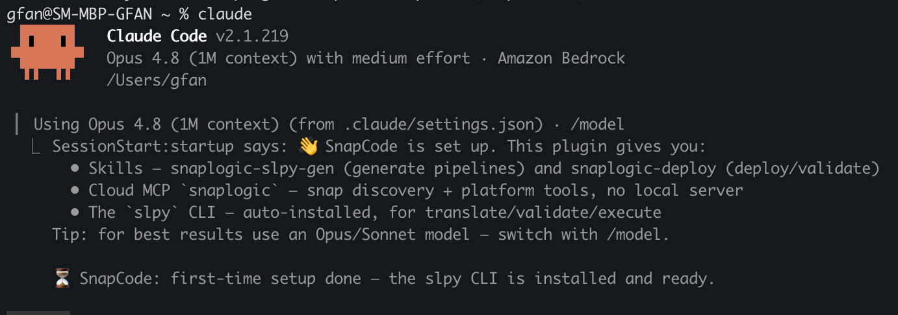

# SnapCode Quickstart (testing)

> **Staging only for now.** This connects to the SnapLogic **canary** pod
> (`cdn.canary.elastic.snaplogicdev.com`). Use your **canary** SnapLogic account.
> Not yet available on production.

## 1. Prerequisites

- Claude Code CLI + Python 3.8+ (`uv` auto-installs if missing; no Node, git, or AWS/GitHub needed).

## 2. Set your credentials (canary)

```bash
export SNAPLOGIC_API_USER="you@yourcompany.com"
export SNAPLOGIC_API_PASS="your-canary-password"
export SNAPLOGIC_BASE_URL="https://cdn.canary.elastic.snaplogicdev.com"
export SNAPLOGIC_ORG_NAME="your-org-name"     # the org you work in
```
Set these **before** launching Claude Code (add to `~/.zshrc` / `~/.bashrc` to persist).

## 3. Install

```bash
claude plugin marketplace add Snap-Developers/SnapCode-CC-Plugin
claude plugin install snapcode@snapcode
```

## 4. First launch — expect a short wait ⏳

```bash
claude
```

**What you'll see (this is normal):**
- A **welcome message appears after a few seconds** — the plugin installs the `slpy`
  CLI in the background on first launch, so give it ~5–20s. The message lists what you
  get (skills, cloud MCP, slpy) and confirms setup is done.
- The **cloud MCP may show as not-connected on the very first session**. If so, **exit
  and start `claude` again** — it connects from the second session on. (One-time only.)

## 5. Verify

```
/mcp                        # snapcode:snaplogic should be "connected"
! slpy eval-expr -e '1 + 2' # should print 3
```

Then just ask Claude to generate or deploy a pipeline.

## Notes

- **`slpy` only works inside a Claude Code session** (the plugin puts it on PATH there).
  A bare `slpy` in a normal terminal after exiting is expected to be "not found".
- **Already used the old SnapCode (clone + Docker) install?** Remove the old bits first —
  they conflict: `claude mcp remove snaplogic` and delete any old `~/.local/bin/slpy`.
- **Updating:** `claude plugin marketplace update snapcode` then
  `claude plugin update snapcode@snapcode`.

